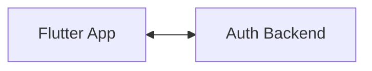
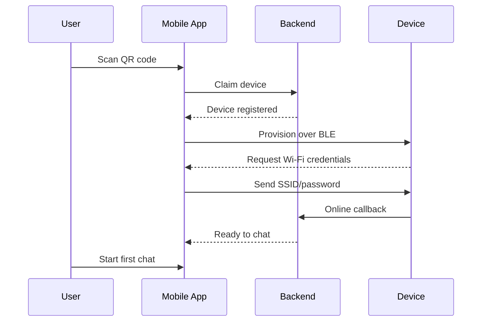
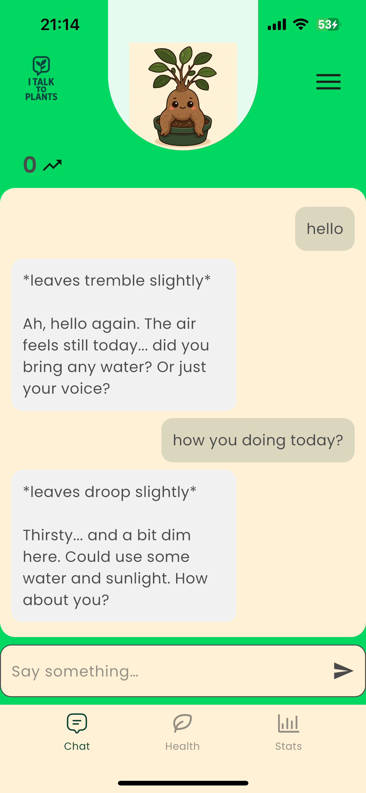
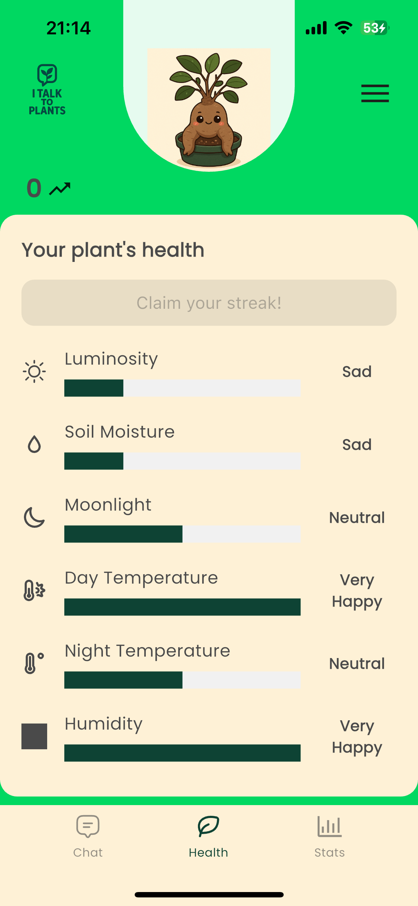
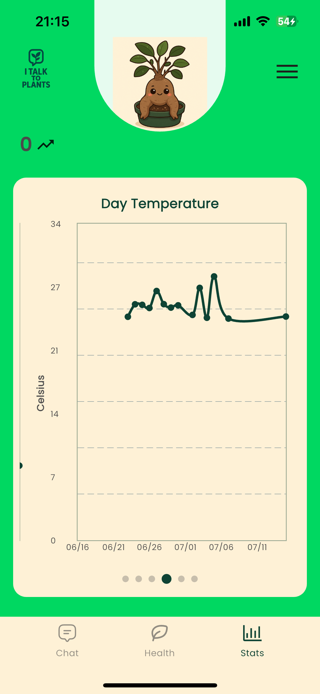
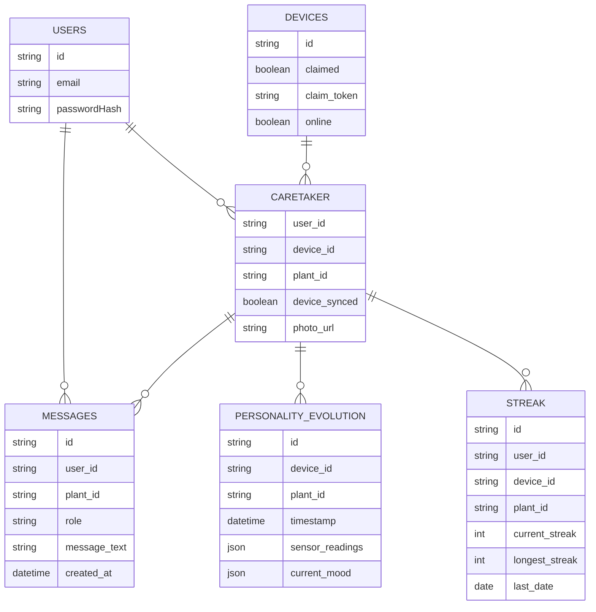

# Talking Plants

A playful experiment in giving houseplants a voice. This repo contains:

* **Flutter mobile client** – the app in `lib/`, starting at [`lib/main.dart`](lib/main.dart).
* **talking-plants-auth** – Node.js backend located at [`talking-plants-auth/src/index.js`](talking-plants-auth/src/index.js).

QR codes for devices are generated with [`qrcodes/generateqr.sh`](qrcodes/generateqr.sh).

## Project Overview

The Flutter application lets users register and chat with a plant. It communicates with the
`talking-plants-auth` server for authentication, chat, health/mood data, and photo upload.

## Setup

1. **Flutter app**
   ```bash
   flutter pub get
   flutter run
   ```

2. **Node server**
   ```bash
   cd talking-plants-auth
   npm install
   npm start
   ```

## Directory Structure

```
lib/                   Flutter source code
assets/                Images and other bundled assets
images/                App screenshots used in this README
qrcodes/               Script and output for device QR codes
talking-plants-auth/   Node.js backend server
web/                   Flutter Web build target
android/, linux/, macos/  Platform‑specific Flutter projects
```

## Architecture Diagram



## Onboarding Sequence Diagram



## Screenshots

Below are a few in‑app screenshots:







## Chat

- **Send**: Mobile app calls `POST /api/chat` with `{ device_id, text }` and displays the returned `reply`.
- **History**: Mobile app loads history via `GET /api/chat/history?device_id=...` and renders the list in the chat pane.
  - Note: The history endpoint reads from the `messages` table. Message persistence on send may be handled by another component in your deployment.

## Photo Upload

- Endpoint: `POST /api/plants/photo` (multipart/form-data)
  - Fields: `device_id`, `plant_id`, optional `avatar_name`, and `photo` file
  - On success, updates caretaker with plant info and stores the image. Files are served from `/uploads/...`.

## Health & Mood

- Latest health snapshot: `GET /api/health/latest?device_id=...`
  - Returns `current_mood` buckets and flags: `status_checked`, `streak_claimed`.
- Mark checked: `POST /api/health/mark-checked` with `{ device_id }` to set today’s `status_checked = 1`.
- Claim streak: `POST /api/health/claim-streak` with `{ device_id }` to update user streaks.
- Current streak: `GET /api/health/current-streak?device_id=...` → `{ current_streak }`.
- Last 30 days chart data: `GET /api/personality-evolution?device_id=...` → daily sensor-derived values.

## Database Schema



---
This repo's most important files are [`lib/main.dart`](lib/main.dart),
[`lib/services/plant_service.dart`](lib/services/plant_service.dart),
[`talking-plants-auth/src/index.js`](talking-plants-auth/src/index.js), and
[`sketch_v2/sketch_v2.ino`](sketch_v2/sketch_v2.ino).
