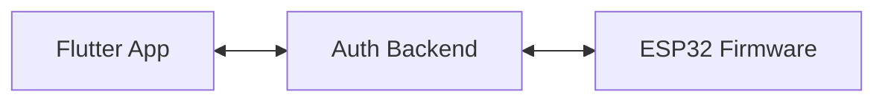
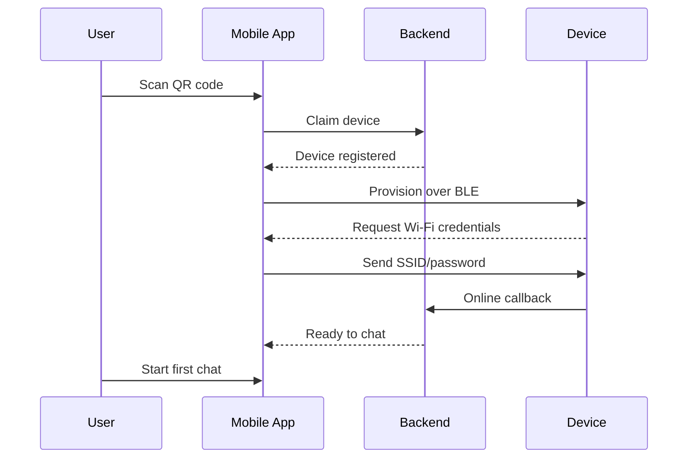
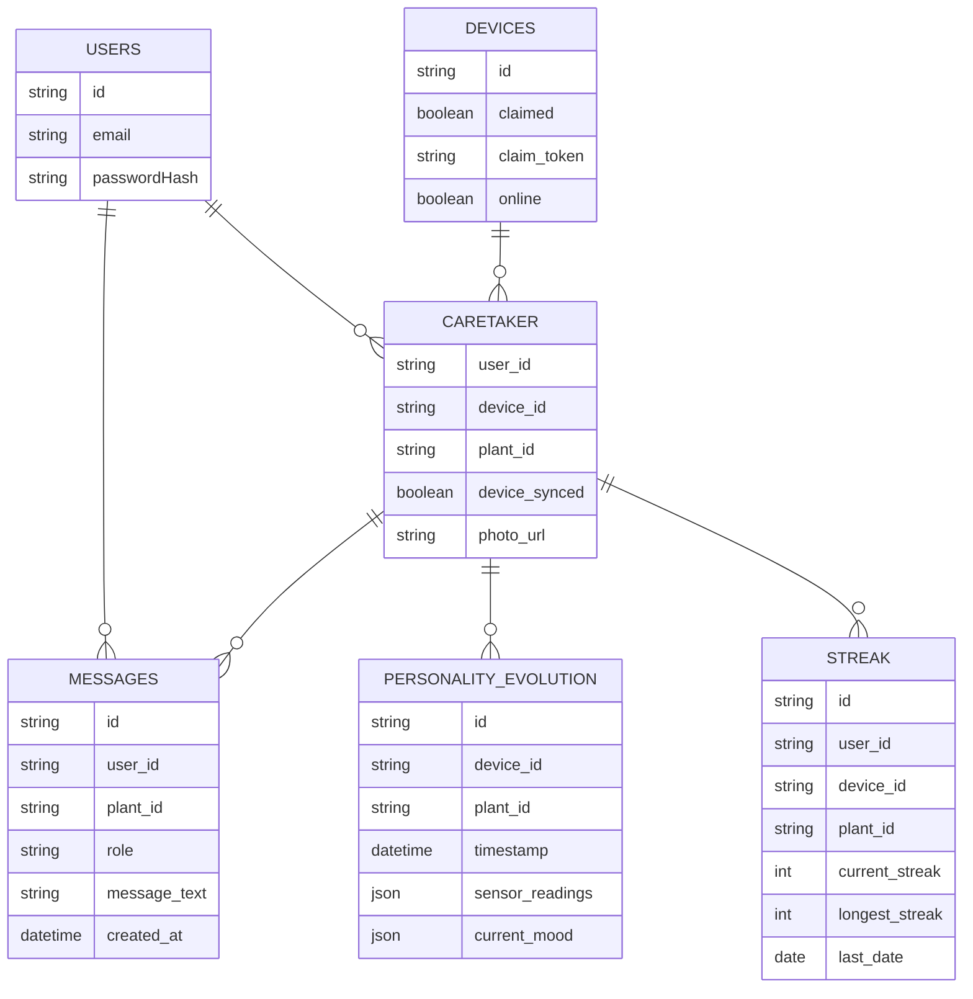

# Talking Plants

A playful experiment in giving houseplants a voice. This repo contains:

* **Flutter mobile client** – the app in `lib/`, starting at [`lib/main.dart`](lib/main.dart).
* **talking-plants-auth** – Node.js backend located at [`talking-plants-auth/src/index.js`](talking-plants-auth/src/index.js).
* **sketch_v2** – ESP32 firmware in [`sketch_v2/sketch_v2.ino`](sketch_v2/sketch_v2.ino).

QR codes for devices are generated with [`qrcodes/generateqr.sh`](qrcodes/generateqr.sh).

## Project Overview

The Flutter application lets users register and chat with a plant. It communicates with the
`talking-plants-auth` server for authentication and storing chat history. The ESP32 runs the
`sketch_v2` firmware which measures sensor data and interacts with the server over Wi‑Fi.

## Setup

1. **Flutter app**
   ```bash
   flutter pub get
   flutter run
   ```

2. **Node server**
   ```bash
   cd talking-plants-auth
   npm install
   npm start
   ```

3. **Firmware** – open `sketch_v2/sketch_v2.ino` in the Arduino IDE or build system of
   your choice and flash it to an ESP32. Edit `sketch_v2/secrets.h` for Wi‑Fi credentials.

## Directory Structure

```
lib/                   Flutter source code
assets/                Images and other bundled assets
qrcodes/               Script and output for device QR codes
sketch_v2/             ESP32 firmware sketch
talking-plants-auth/   Node.js backend server
web/                   Flutter Web build target
android/, linux/, macos/  Platform‑specific Flutter projects
```

## Architecture Diagram



## Onboarding Sequence Diagram



## Database Schema



---
This repo's most important files are [`lib/main.dart`](lib/main.dart),
[`lib/services/plant_service.dart`](lib/services/plant_service.dart),
[`talking-plants-auth/src/index.js`](talking-plants-auth/src/index.js), and
[`sketch_v2/sketch_v2.ino`](sketch_v2/sketch_v2.ino).
